# CLI / Environment Task

Managing the environment for this web app using built-in OS command-line tools.
Each operation is shown for **two different systems**: Windows (PowerShell) and
Linux (bash). The scripts under [`scripts/`](../scripts) chain several operations
together rather than running one command per need.

## Scripts in this repo

| Script | Windows | Linux |
| --- | --- | --- |
| Environment setup (check tools, install deps, prep folders) | `scripts/windows/setup-env.ps1` | `scripts/linux/setup-env.sh` |
| Filesystem ops (create, list, copy, move, link, permissions, delete) | `scripts/windows/fs-ops.ps1` | `scripts/linux/fs-ops.sh` |
| Run several tasks in parallel | `scripts/windows/run-parallel.ps1` | `scripts/linux/run-parallel.sh` |
| Disk/dir size report | `scripts/windows/disk-report.ps1` | — |
| Same fs work in NodeJS (server-side) | `node-scripts/fs-ops.js` | (cross-platform) |
| DB-style migration over the JSON data | `node-scripts/migrate.js` | (cross-platform) |

## Filesystem operations — commands per system

| Operation | Windows (PowerShell) | Linux (bash) |
| --- | --- | --- |
| Create dir | `New-Item -ItemType Directory -Path x` | `mkdir -p x` |
| Create file | `Set-Content x\f.txt "text"` | `echo "text" > x/f.txt` |
| List | `Get-ChildItem x` | `ls -l x` |
| Copy | `Copy-Item a b` | `cp a b` |
| Move / rename | `Move-Item a b` | `mv a b` |
| Symbolic link | `New-Item -ItemType SymbolicLink -Path l -Target t` *(needs admin / Developer Mode)* | `ln -s t l` *(no elevation)* |
| Hard link | `New-Item -ItemType HardLink -Path l -Target t` | `ln t l` |
| Delete (recursive) | `Remove-Item x -Recurse -Force` | `rm -rf x` |

## Permissions

| Goal | Windows | Linux |
| --- | --- | --- |
| Make a file read-only | `icacls f.txt /grant:r "Users:(R)"` | `chmod 444 f.txt` |
| Restore write | `icacls f.txt /grant "Users:(M)"` | `chmod 644 f.txt` |
| Inspect | `icacls f.txt` | `ls -l f.txt` |

**Concept:** permissions control who may read/write/execute a file. On Linux this is
the classic `rwx` triad for owner/group/other (`chmod`); on Windows it is ACL-based
(`icacls`). Creating a *symbolic* link on Windows itself requires elevated rights,
which is a permissions difference between the two systems.

## Running scripts in parallel

| | Windows | Linux |
| --- | --- | --- |
| Launch in background | `Start-Job { ... }` | `command &` |
| Wait for all | `$jobs \| Wait-Job` | `wait` |
| Collect output | `Receive-Job $job` | (stdout streams directly) |

Both `run-parallel` scripts launch three workers that sleep 1/2/3s. Total wall time
is ~3s (not 6s), proving they ran concurrently.

## Editing files via the command line

| Action | Windows | Linux |
| --- | --- | --- |
| Open an editor | `notepad file.txt` | `nano file.txt` / `vi file.txt` |
| Overwrite content | `Set-Content file.txt "new"` | `echo "new" > file.txt` |
| Append a line | `Add-Content file.txt "more"` | `echo "more" >> file.txt` |
| In-place find/replace | `(Get-Content f) -replace 'a','b' \| Set-Content f` | `sed -i 's/a/b/' f` |

## Connecting to another computer (SSH)

The same OpenSSH client ships with modern Windows and Linux, so the command itself is
identical; the difference is where keys live and how you install the server.

| Action | Windows | Linux |
| --- | --- | --- |
| Generate a key | `ssh-keygen -t ed25519` | `ssh-keygen -t ed25519` |
| Key location | `C:\Users\<you>\.ssh\id_ed25519` | `~/.ssh/id_ed25519` |
| Copy public key to server | `type $env:USERPROFILE\.ssh\id_ed25519.pub \| ssh user@host "cat >> ~/.ssh/authorized_keys"` | `ssh-copy-id user@host` |
| Connect | `ssh user@host` | `ssh user@host` |
| Run one remote command | `ssh user@host "ls -l"` | `ssh user@host "ls -l"` |
| Copy a file over | `scp file user@host:~/` | `scp file user@host:~/` |

See [`03-remote-setup.md`](03-remote-setup.md) for the full walkthrough of setting up
the remote Linux box this connects to.

## Screenshots

Environment setup (<code>setup-env.ps1</code> / <code>setup-env.sh</code>)

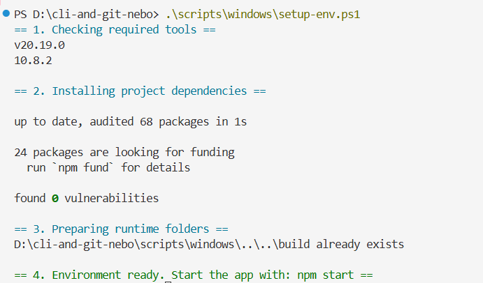

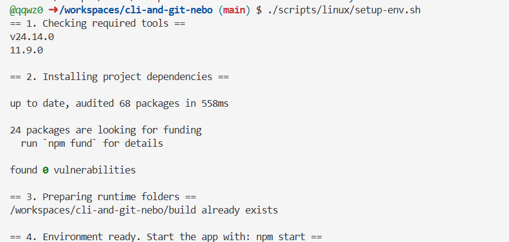

Filesystem operations chained (<code>fs-ops.ps1</code> on Windows)

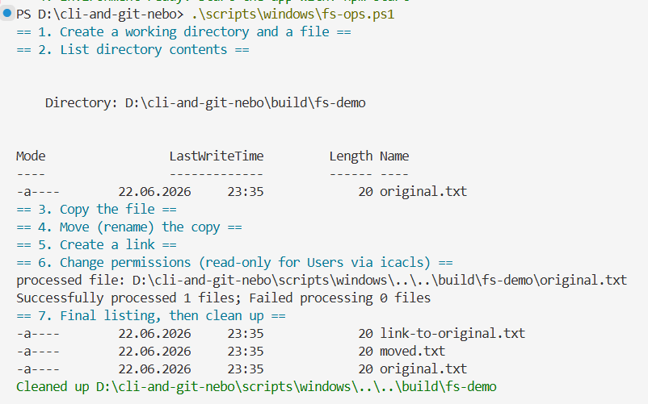

Filesystem operations on Linux (real symlink + chmod)

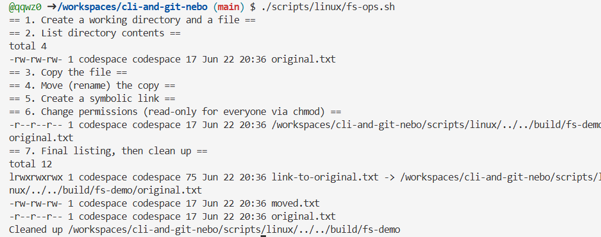

Running scripts in parallel (Windows + Linux)

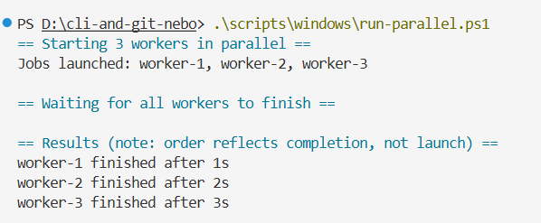
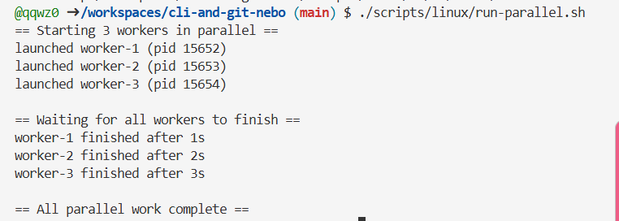

Editing files via CLI (Windows <code>Set-Content</code> + Linux <code>sed</code>)

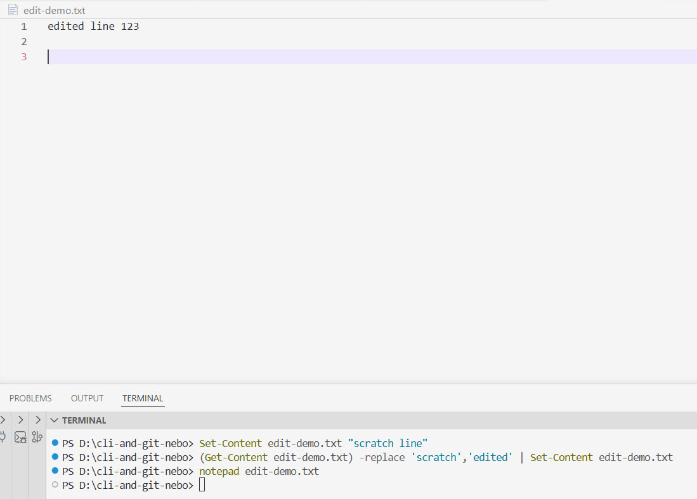
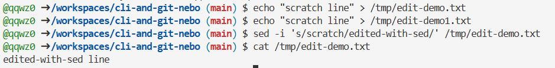
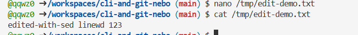

SSH (Windows <code>gh codespace ssh</code> + Linux <code>ssh -V</code> / handshake)

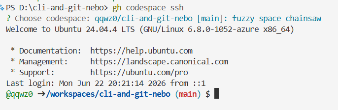
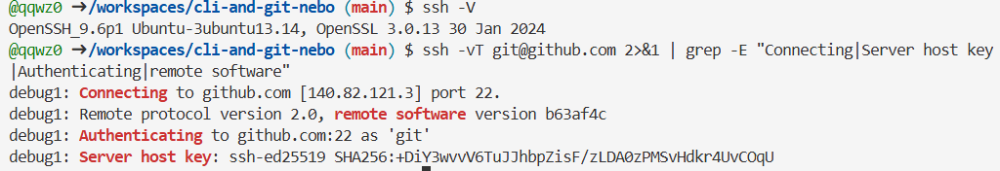

NodeJS server-side scripts (<code>fs-ops.js</code> + <code>migrate.js</code>)

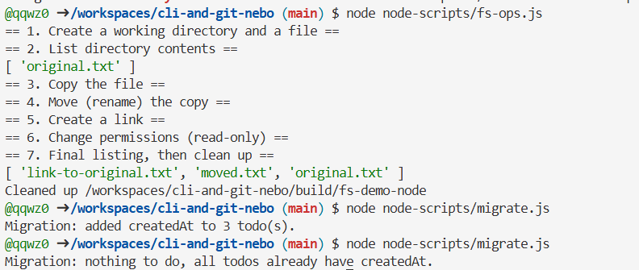

## Out of scope (per the task brief)

Framework-specific CLIs, version control (covered separately), automation scripting,
containers/VMs, and bundler configuration.
