# Git / Version Control Task

How version control was used while building this app. The commit history **is** the
artifact — every skill below maps to real commits in this repo.

## Commands used (with common flags)

| Command                               | What it did here                                           |
| ------------------------------------- | ---------------------------------------------------------- |
| `git init -b main`                    | start the repo on a `main` branch                          |
| `git add <files>`                     | stage changes                                              |
| `git commit -m "..."`                 | record a commit                                            |
| `git push -u origin main`             | publish and set upstream                                   |
| `git clone <url>`                     | copy the repo onto the remote Linux box (see remote-setup) |
| `git pull`                            | fetch + merge remote changes (on the Linux clone)          |
| `git checkout -b <branch>`            | create + switch to a feature branch                        |
| `git diff main`                       | review a branch's changes against master                   |
| `git merge --no-ff <branch>`          | merge, forcing a merge commit                              |
| `git rebase main`                     | replay a branch on top of main                             |
| `git merge --ff-only <branch>`        | fast-forward (no merge commit)                             |
| `git cherry-pick <hash>`              | copy one commit onto another branch                        |
| `git revert <hash>`                   | undo a commit with a new commit                            |
| `git reset --hard <hash>`             | discard commits (used locally to undo a mistake)           |
| `git commit --amend`                  | adjust the most recent commit                              |
| `git config core.hooksPath .githooks` | enable the tracked git hook                                |

## Branching

- `feature/api-endpoint` — the GET + POST API. Merged into `main` with `--no-ff`
  (visible merge commit / "merging" strategy).
- `feature/cli-scripts` — the Windows + Linux + Node scripts. Brought into `main`
  with `rebase` + `--ff-only` (linear history / "rebasing" strategy).
- `experiment/extra-fs-demo` — a throwaway branch whose single commit was
  `cherry-pick`ed onto `main`.

A `git log --oneline --graph --all` shows the contrast: the api branch makes a merge
**bubble**, while the cli-scripts branch sits **flat** on top of main.

## Two merge strategies — the difference

|                      | `merge --no-ff`                | `rebase` + `ff-only`                 |
| -------------------- | ------------------------------ | ------------------------------------ |
| History shape        | branch + merge commit (bubble) | linear, no extra commit              |
| Keeps branch context | yes (you see it was a branch)  | no (looks like it was always linear) |
| Rewrites commits     | no                             | yes (new hashes)                     |
| Used for             | `feature/api-endpoint`         | `feature/cli-scripts`                |

## Cherry-pick vs revert vs reset (the three "move/undo" tools)

- **cherry-pick** — copies a _change_ to another branch as a **new** commit (different
  hash). Used to pull `disk-report.ps1` from the experiment branch onto main.
- **revert** — undoes a commit by adding a **new** commit; history is preserved
  (safe on shared branches). Used to undo the deliberately-broken README commit.
- **reset** — moves the branch pointer and can **erase** commits; rewrites history.
  Only used locally to undo a mistaken cherry-pick before anything was pushed.

## Pull request

`feature/api-endpoint` was pushed and opened as a PR on GitHub for code review, then
merged. (`gh pr create --base main --head feature/api-endpoint ...`)

## Git hook

`.githooks/pre-commit` blocks any commit whose staged files contain the marker
`DONOTCOMMIT`. Enabled per-clone with `git config core.hooksPath .githooks`.

> Note: `core.hooksPath` is local config and does **not** travel on clone — it must be
> re-run on each machine (including the Linux box).

## Screenshots

Repo init + first commits + push (<code>git log</code>, <code>git push</code>)

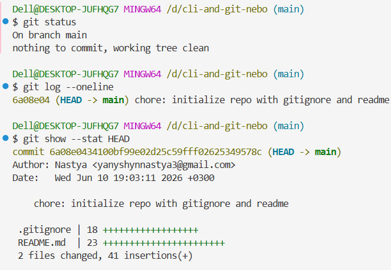

Feature branch + diff to master (<code>git diff main</code>)

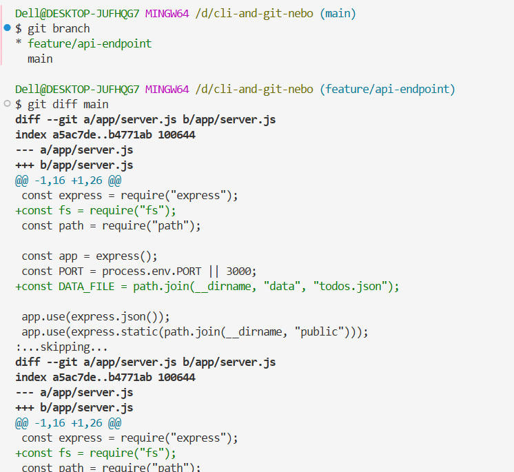

Pull request on GitHub (created + merged)

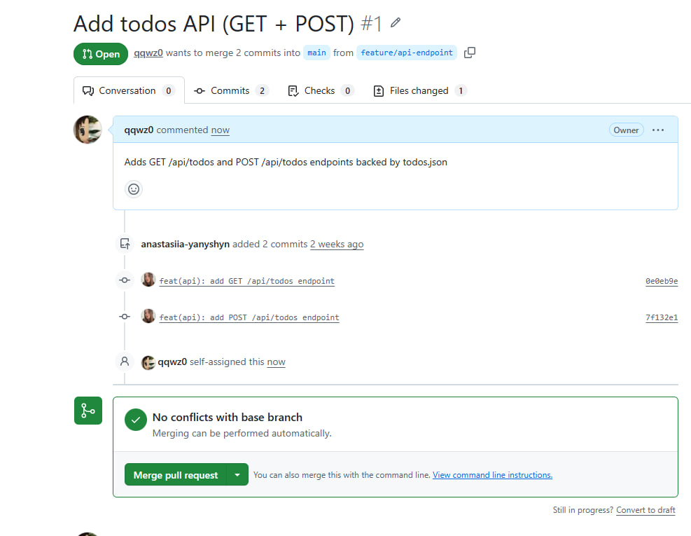
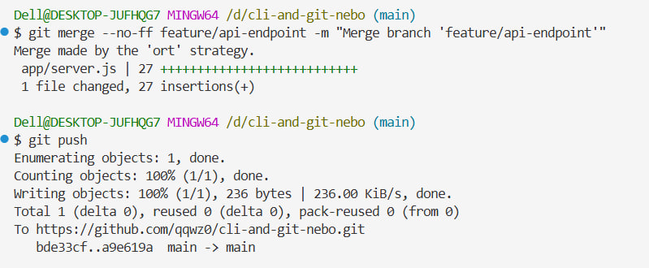

Two merge strategies in one graph (merge bubble vs flat rebase)

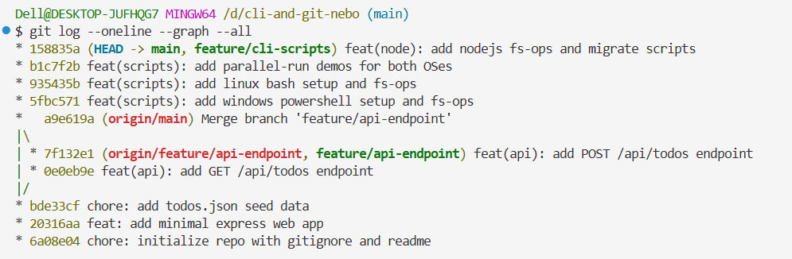

Cherry-pick (same change, different hash on two branches)

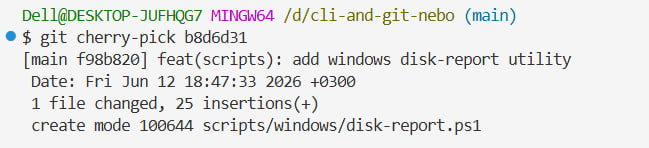
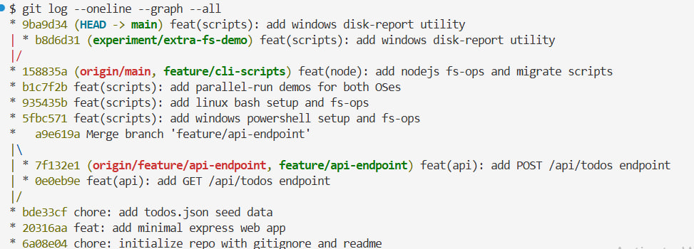

Revert (broken commit + its revert in history)

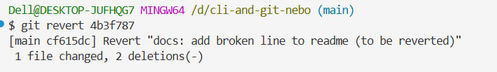
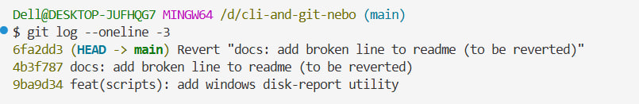

Git hook blocking a commit (<code>DONOTCOMMIT</code> aborted)

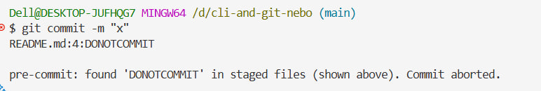

Pull on the remote Linux (Codespace)

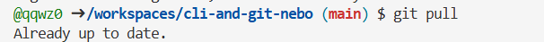

## Out of scope (per the task brief)

Release strategy, OS CLIs (covered separately), automation scripting, containers/VMs.
