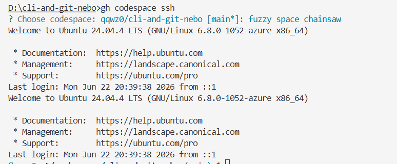

# Remote Linux + SSH Setup (GitHub Codespace)

The "two different systems" requirements (SSH, running the bash scripts, `git clone`
and `git pull` on Linux) need a real Linux machine reachable from this Windows box.

This repo uses a **GitHub Codespace** as that remote Linux machine. A Codespace is a
cloud Ubuntu container attached to the repo; `gh codespace ssh` connects to it over
SSH. It needs no VM provisioning, no card, and no manual SSH-key copying — the repo is
already cloned inside it.

## Prerequisites

- `gh` CLI authenticated (`gh auth status`) with the **`codespace`** scope. If it is
  missing, add it once:
  ```powershell
  gh auth refresh -h github.com -s codespace
  ```

## Steps (run from Windows, in this repo)

1. **Make sure `main` is pushed** so the Codespace clones the latest history:

   ```powershell
   git push origin main
   ```

2. **Connect to the Codespace** (creates one on first use, then SSHes in):

   ```powershell
   gh codespace ssh
   ```

   The prompt changes from `Dell@DESKTOP-... /d/cli-and-git-nebo` to
   `@qqwz0 ➜ /workspaces/cli-and-git-nebo` — that is how you know you are now on the
   remote Linux machine.

3. **Run the Linux scripts inside the Codespace:**

   ```bash
   node --version
   chmod +x scripts/linux/*.sh
   ./scripts/linux/setup-env.sh
   ./scripts/linux/fs-ops.sh        # creates a REAL symlink + chmod on real Linux
   ./scripts/linux/run-parallel.sh
   git config core.hooksPath .githooks   # re-enable the hook on this machine
   ```

4. **Demonstrate `git pull`** (after pushing a change from Windows):

   ```bash
   git pull
   ```

5. **SSH client on the Linux side** (proves SSH works on the second system):

   ```bash
   ssh -V
   ssh -vT git@github.com 2>&1 | grep -E "Connecting|Server host key|Authenticating|remote software"
   ```

   The connection and host-key exchange succeed (authentication is then declined
   because the Codespace has no SSH key registered to GitHub — that is expected and
   does not affect the SSH-client evidence).

6. **Editing a file via the CLI on Linux:**

   ```bash
   echo "scratch line" > /tmp/edit-demo.txt
   sed -i 's/scratch/edited-with-sed/' /tmp/edit-demo.txt
   cat /tmp/edit-demo.txt
   nano /tmp/edit-demo.txt    # interactive: edit, Ctrl+O Enter to save, Ctrl+X to exit
   ```

7. **Leave the Codespace** when done:
   ```bash
   exit
   ```

## Difference observed between the two systems

On Linux, `ln -s` produces a true symbolic link with no special privileges:

```
lrwxrwxrwx ... link-to-original.txt -> .../original.txt
```

On Windows the same step required either an elevated shell / Developer Mode for a
_symbolic_ link, so the script used a _hard_ link instead. Same goal, different
OS constraints — the core lesson of this task.

## Screenshots

<details>
<summary>Connecting to the Codespace (prompt changes to <code>@qqwz0 ➜ /workspaces/...</code>)</summary>



</details>

<details>
